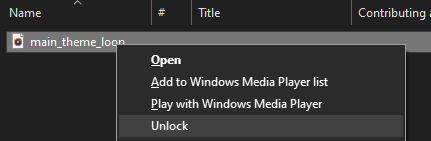
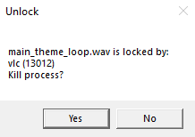

# File Unlocker

A simple tool for MS Windows you can integrate to File Explorer and then use it to kill all processes that lock a file **literally by three mouse clicks**.





You can also use the tool from a command line with _-silent_ (or _-s_) as a second argument to bypass the dialog window while the first argument is a path to file or folder you wish to unlock.

```
FileUnlocker.exe path -silent
```